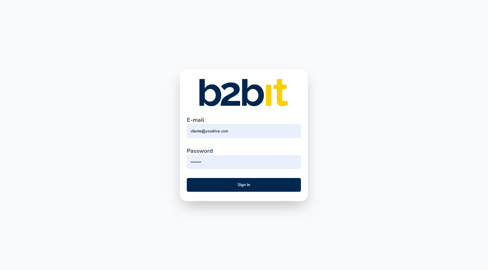

# 🔐 Login-Auth

## 📌 Sobre o Projeto

> Sistema de autenticação completo com React, TypeScript e validação robusta.
>
> Aplicação desenvolvida para demonstrar implementação de autenticação moderna com gerenciamento de estado, validação de formulários e testes end-to-end.



## 🚀 Tecnologias Utilizadas

- [React](https://reactjs.org) - Biblioteca para interfaces de usuário
- [TypeScript](https://www.typescriptlang.org/) - Superset do JavaScript com tipagem estática
- [Vite](https://vitejs.dev/) - Build tool moderna e rápida
- [React Router DOM](https://reactrouter.com/) - Roteamento para React
- [React Hook Form](https://www.react-hook-form.com/) - Gerenciamento de formulários
- [Zod](https://zod.dev/) - Validação de schemas TypeScript-first
- [Axios](https://axios-http.com/) - Cliente HTTP para requisições
- [Tailwind CSS](https://tailwindcss.com/) - Framework CSS utilitário
- [Shadcn](https://ui.shadcn.com/) - Componentes acessíveis e customizáveis
- [Cypress](https://www.cypress.io/) - Testes end-to-end

## ✨ Funcionalidades

- 🔑 **Autenticação Completa**: Login com validação de credenciais
- 📝 **Validação de Formulários**: Validação client-side com Zod
- 🔄 **Gerenciamento de Estado**: Context API para autenticação
- 🔔 **Notificações**: Sistema de toast para feedback do usuário
- 🧪 **Testes E2E**: Cobertura completa com Cypress
- 🛡️ **Proteção de Rotas**: Redirecionamento baseado em autenticação
- 💾 **Persistência**: Dados salvos no localStorage

## 📦 Instalação e Configuração

Instruções de como rodar o projeto:

1. **Clone o projeto em sua máquina:**

   ```sh
   git clone https://github.com/seu-usuario/login-auth.git
   cd login-auth
   ```

2. **Instale as dependências:**

   ```sh
   npm install
   ```

3. **Inicie o servidor de desenvolvimento:**

   ```sh
   npm run dev
   ```

4. **Seu projeto estará rodando em:**

   ```
   http://localhost:5173
   ```

5. **Para testar a aplicação, utilize as seguintes credenciais:**

   ```
   email: cliente@youdrive.com
   password: password
   ```

> 💡 **Dica**: Estas credenciais são para demonstração.

## 🧪 Executando os Testes

### Testes E2E com Cypress

   ```sh
   # Abrir interface do Cypress
   npm run test:e2e

   # Executar testes em modo headless
   npm run test:e2e:run
   ```

## 🚀 Deploy

O projeto utiliza o deploy da [Vercel](https://vercel.com), para visualizar o mesmo, por favor [clique aqui!](https://login-auth-test.vercel.app/)

## 📝 Licença

[MIT License](https://github.com/RayaniGomes/Evently/blob/main/LICENSE) © [Rayani Gomes](https://github.com/RayaniGomes)

---

⭐ Se este projeto te ajudou, considere dar uma estrela!
